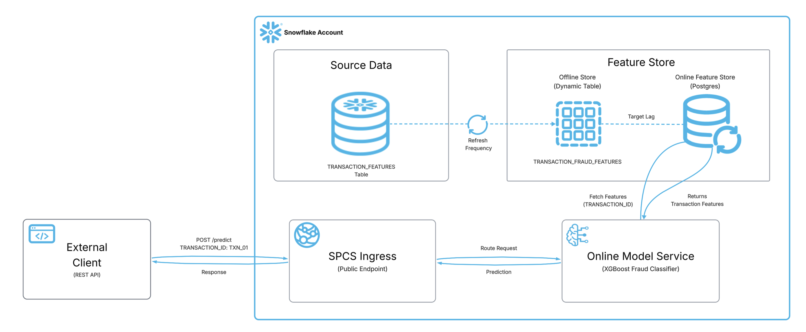

# Feature Store + ML Inference Service Demo

End-to-end demo of Snowflake's **Online Feature Store (Postgres-backed)** integrated with a real-time **ML Inference Service** using `feature_sources_per_function` for **fraud detection**.

## Why This Matters

In production ML systems, one of the hardest problems is **training-serving skew** — when the features used at inference time drift from those used during training. This happens because training pipelines and serving pipelines are often built separately, with different code paths, different data sources, and different transformation logic.

The **Feature Store + Inference Service integration** solves this by:

- **Single source of truth** — The same Feature View definitions serve both training and inference. No duplicate feature logic to maintain.
- **Decoupled clients from feature complexity** — API consumers send only an entity key (e.g. a transaction ID). They don't need to know which features exist, how they're computed, or where they're stored.
- **Low-latency serving** — The Postgres-backed online store provides millisecond-level feature retrieval, purpose-built for real-time inference workloads.
- **Zero-effort feature freshness** — Features sync automatically from the source table to the online store with a configurable target lag (e.g. 10 seconds). No ETL pipelines to manage.
- **Simplified service contracts** — When you add, remove, or modify features, the inference service adapts without requiring API changes or client updates.

This pattern is essential for real-time fraud detection, where you need fresh features served at low latency without burdening the caller with feature assembly.

## What This Notebook Does

This notebook uses **synthetic transaction data** to demonstrate a fraud detection ML pipeline. The same pattern applies to any ML use case where you want low-latency feature serving integrated with real-time inference.

- Creates a synthetic transaction dataset (200 records) with features like amount, merchant category, distance from home, time since last transaction, and daily transaction count
- Sets up a **Feature Store** with a `TRANSACTION` entity and `TRANSACTION_FRAUD_FEATURES` Feature View
- Enables **Postgres-backed online serving** with 10-second target lag
- Trains an **XGBoost** binary classifier to predict fraudulent transactions
- Registers the model in the **Snowflake Model Registry**
- Creates a **compute pool** for the inference service
- Deploys a real-time **inference service** on SPCS with `feature_sources_per_function`
- Shows how to invoke the service — callers send only `TRANSACTION_ID` and the service fetches features automatically

## Architecture



## Prerequisites

- Snowflake account with **ACCOUNTADMIN** role
- A compute pool (the notebook creates `ML_ONLINE_CPU_POOL`)
- Snowflake Notebook with **Container Runtime** (CPU)
- `snowflake-ml-python >= 1.44.0`

## Quickstart

### 1. Open the Notebook

Open `example.ipynb` in a Snowflake Workspace with a Container Runtime service (CPU, Python 3.10+).

### 2. Run All Cells in Order

The notebook is self-contained. Run all cells top-to-bottom:

- Configuration at the top defines versions and names (edit here to bump versions)
- Set up the database, synthetic data, and Feature Store with Postgres online serving
- Register features and verify online retrieval
- Train and register the XGBoost fraud classifier
- Create the compute pool and deploy the online inference service

### 3. Invoke the Endpoint

From any external client (curl, Python, web app):

```bash
curl -X POST "https://<ENDPOINT_URL>/predict" \
  -H 'Authorization: Snowflake Token="<PAT_TOKEN>"' \
  -H 'Content-Type: application/json' \
  -d '{"dataframe_split": {"index": [0, 1, 2], "columns": ["TRANSACTION_ID"], "data": [["TXN_0001"], ["TXN_0010"], ["TXN_0050"]]}}'
```

You send **only** `TRANSACTION_ID` — the service fetches all features (`TRANSACTION_AMOUNT`, `MERCHANT_CATEGORY`, `DISTANCE_FROM_HOME`, `TIME_SINCE_LAST_TXN`, `DAILY_TXN_COUNT`) from the Postgres online store automatically via `feature_sources_per_function`.

## Cleanup

```sql
DROP SERVICE IF EXISTS ML_DEMO_INF_FS_LOOKUP.FRAUD_ML_SERVICE_FS.FRAUD_DETECTION_SVC;
DROP MODEL IF EXISTS ML_DEMO_INF_FS_LOOKUP.FRAUD_ML_SERVICE_FS.FRAUD_XGBOOST;
DROP COMPUTE POOL IF EXISTS ML_ONLINE_CPU_POOL;
DROP DATABASE IF EXISTS ML_DEMO_INF_FS_LOOKUP;
```

## References

- https://docs.snowflake.com/en/developer-guide/snowflake-ml/inference/real-time-inference-rest-api
